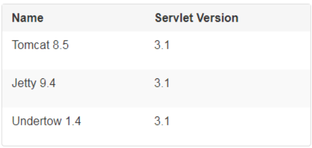

## Spring Boot Embedded Servers - Tomcat, Jetty and Undertow

- Spring Boot includes support for embedded Tomcat, Jetty, and Undertow servers.

Spring Boot supports the following embedded servlet containers:

## 1. Spring Boot Default Embedded Server - Tomcat

### `Tomcat:`

- Apache Tomcat là máy chủ web và ứng dụng nhúng phổ biến cho Java Servlet và JSP.
- Tomcat được sử dụng rộng rãi và có sẵn trong nhiều dự án Java.
- Tomcat hỗ trợ Servlet và JSP, làm cho nó phù hợp cho các ứng dụng web truyền thống.
- Trong Spring Boot, Tomcat là máy chủ mặc định nếu không có máy chủ nhúng nào được chỉ định.

### `Jetty:`

- Jetty là một máy chủ web và servlet container được sử dụng cho triển khai ứng dụng web Java.
- Jetty có hiệu suất tốt và khả năng xử lý đồng thời cao, phù hợp cho các ứng dụng có lưu lượng cao.
- Jetty cũng hỗ trợ HTTP/2, WebSocket và các tính năng hiện đại khác.
- Trong Spring Boot, bạn có thể sử dụng Jetty bằng cách thêm dependency spring-boot-starter-jetty vào pom.xml và cấu hình trong application.properties hoặc application.yml.

### `Undertow:`

- Undertow là một máy chủ web nhẹ và hiệu suất cao được phát triển bởi JBoss (Red Hat).
- Undertow có hiệu suất cao và tiêu thụ ít tài nguyên, phù hợp cho các ứng dụng yêu cầu hiệu suất tốt và đáp ứng nhanh chóng.
- Trong Spring Boot, bạn có thể sử dụng Undertow bằng cách thêm dependency spring-boot-starter-undertow vào pom.xml và cấu hình trong application.properties hoặc application.yml.

