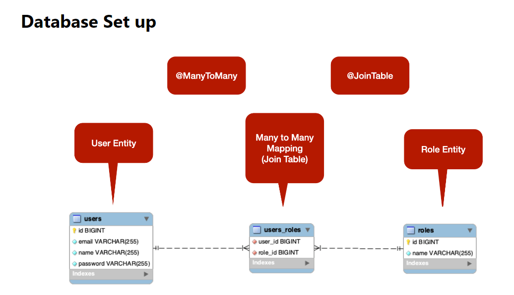

## Spring Security Overview

- JWT: JSON WEB TOKEN
- JWT sử dụng trong mục đích ủy quyền và xác thực



## Các thành phần của JWT
- Header (Tiêu đề): Header chứa thông tin về cách JWT được mã hóa và chữ ký. 
- alg (Algorithm): Xác định thuật toán mã hóa được sử dụng để tạo chữ ký. Ví dụ: "HS256" cho mã hóa HMAC-SHA256.
- typ (Type): Loại của JWT, thường là "JWT".
```json
{
  "alg": "HS256",
  "typ": "JWT"
}
```

- Payload (Nội dung): Payload cũng là một đối tượng JSON, bao gồm các khóa (keys) và giá trị (values) của dữ liệu.
  - iss (Issuer): Người tạo ra JWT.
  - sub (Subject): Đối tượng mà JWT áp dụng cho.
  - aud (Audience): Người nhận dự định của JWT.
  - exp (Expiration Time): Thời gian khi JWT sẽ hết hạn.
  - nbf (Not Before): Thời gian trước khi JWT trở nên hiệu lực.
  - iat (Issued At): Thời gian JWT được tạo ra.
  - jti (JWT ID): Một ID duy nhất cho JWT.

```json
{
  "sub": "1234567890",
  "name": "John Doe",
  "iat": 1516239022
}
```

- Signature (Chữ ký): Chữ ký được tạo bằng cách kết hợp Header và Payload với một khóa bí mật (hoặc công khai) sử dụng thuật toán đã được chỉ định trong Header.
```json
HMACSHA256(
  base64UrlEncode(header) + "." +
  base64UrlEncode(payload),
  secret
)
```

