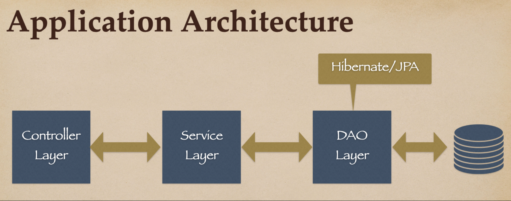
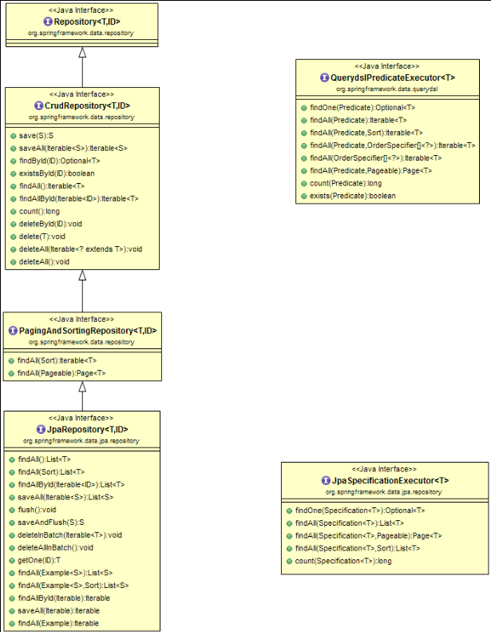

## Spring data JPA

## What Spring Data JPA?
Let's first understand what is the problem and how Spring Data JPA provides a solution to solve the problem.

### Problem
In typical three-layer Spring application architecture, we create three layers - Controller, Service, and DAO/Repository layer.

## Spring Data Commons and Spring Data JPA Repositories/interfaces

Spring Data Commons project provides the following interfaces:

- Repository<T, ID extends Serializable> interface
- CrudRepository<T, ID extends Serializable> interface
- PagingAndSortingRepository<T, ID extends Serializable> interface
- QueryDslPredicateExecutor interface

## The Repository<T, ID extends Serializable> interface

